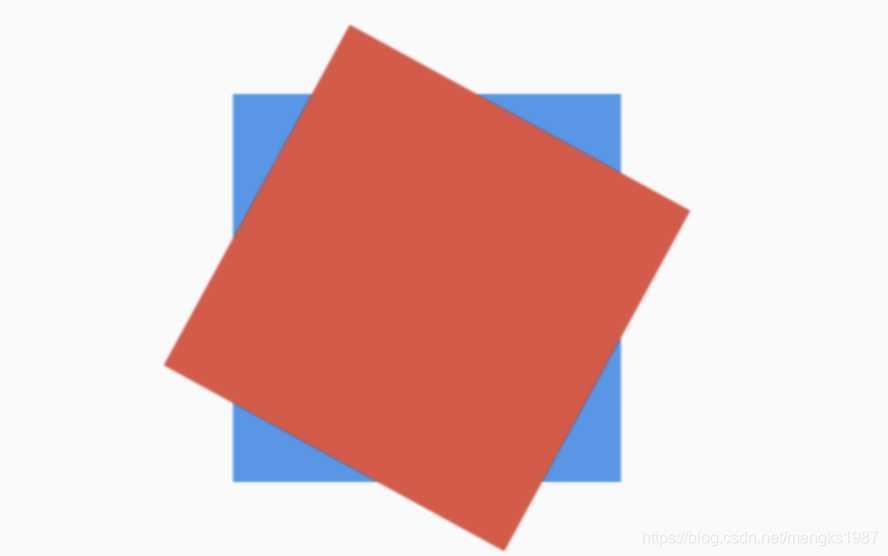

# Transform

Transform可以对子组件进行变化，比如旋转、平移、缩放等。

基本用法：

```dart
return Transform(
  transform: Matrix4.rotationZ(0.5),
  child: Container(
    height: 100,
    width: 100,
    color: Colors.red,
  ),
);
```

`transform`参数是变化4x4矩阵，上面的案例是绕z轴旋转弧度，效果如下：


`origin`参数表示变换矩阵的坐标，默认是（0,0）即左上角，如果想围绕圆心旋转，代码如下；

```dart
Container(
  color: Colors.blue,
  child: Transform(
    transform: Matrix4.rotationZ(0.5),
    origin: Offset(50, 50),
    child: Container(
      height: 100,
      width: 100,
      color: Colors.red,
    ),
  ),
)
```

效果如下：



Transform为方便调用构建了`Transform.translate`、`Transform.rotate`和`Transform.scale`，用法如下：

```dart
Transform.scale(
  scale: 0.5,
  child: Container(
    height: 100,
    width: 100,
    color: Colors.red,
  ),
)
```

