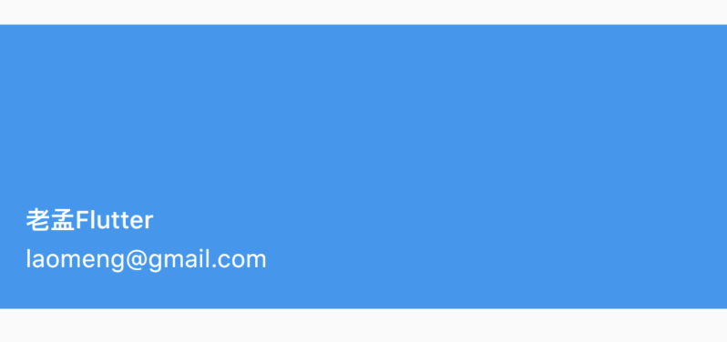
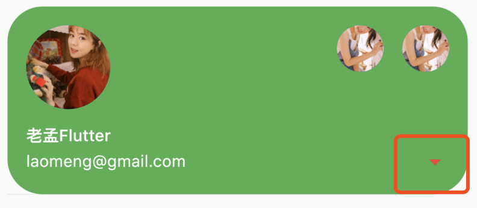
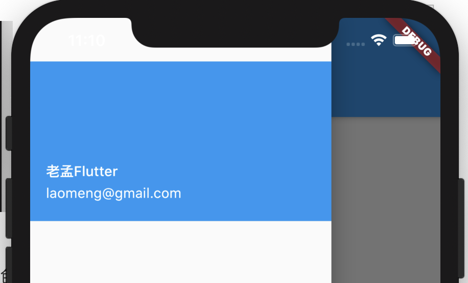

## UserAccountsDrawerHeader

通常用于[Drawer]的`header`控件，基础用法如下：

```dart
UserAccountsDrawerHeader(
  accountName: Text('老孟Flutter'),
  accountEmail: Text('laomeng@gmail.com'),
)
```

效果如下：



设置`decoration`：

```dart
UserAccountsDrawerHeader(
  decoration: BoxDecoration(
    color: Colors.green,
    borderRadius: BorderRadius.all(Radius.circular(30))
  ),
  accountName: Text('老孟Flutter'),
  accountEmail: Text('laomeng@gmail.com'),
)
```

效果如下：


设置当前头像和其他账号头像：

```dart
UserAccountsDrawerHeader(
  decoration: BoxDecoration(
    color: Colors.green,
    borderRadius: BorderRadius.all(Radius.circular(30))
  ),
  currentAccountPicture: CircleAvatar(backgroundImage: AssetImage('images/2.png'),),
  otherAccountsPictures: <Widget>[
    CircleAvatar(backgroundImage: AssetImage('images/1.png'),),
    CircleAvatar(backgroundImage: AssetImage('images/1.png'),),
  ],
  accountName: Text('老孟Flutter'),
  accountEmail: Text('laomeng@gmail.com'),
)
```

效果如下：


设置margin：

```dart
UserAccountsDrawerHeader(
  margin: EdgeInsets.symmetric(vertical: 10,horizontal: 10),
  ...
)
```

效果如下：


`onDetailsPressed`参数不为null时，右下角出现一个三角箭头，三角箭头可以设置其颜色，具有点击效果，可以用于展开详细信息，用法如下：

```dart
UserAccountsDrawerHeader(
  onDetailsPressed: (){
    print('onDetailsPressed');
  },
  arrowColor: Colors.red,
  ...
)
```

效果如下：




UserAccountsDrawerHeader一般用[Draw]组件：

```dart
Scaffold(
  drawer: Drawer(
    child: ListView(
      children: <Widget>[
        UserAccountsDrawerHeader(
          accountName: Text('老孟Flutter'),
          accountEmail: Text('laomeng@gmail.com'),
        ),
      ],
    ),
  ),
  ...
)
```

效果如下：



