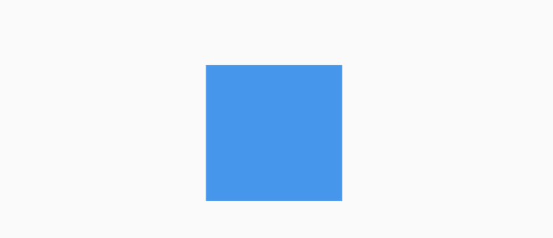

## Visibility

控制子组件隐藏/可见的组件

```dart
Visibility({
    Key key,
    @required this.child,
    this.replacement = const SizedBox.shrink(),//不可见时显示的组件（当maintainState=false）
    this.visible = true,//子组件是否可见，默认true（可见）
    this.maintainState = false,//不可见时是否维持状态，默认为false
    this.maintainAnimation = false,//不可见时，是否维持子组件中的动画
    this.maintainSize = false,//不可见时是否留有空间
    this.maintainSemantics = false,//不可见时是否维持它的语义
    this.maintainInteractivity = false,//不可见时是否具有交互性
  })
```


Offstage与Visibility比较:

Offstage是控制组件隐藏/可见的组件，如果感觉有些单调功能不全，我们可以使用Visibility，Visibility也是控制子组件隐藏/可见的组件。不同是的Visibility有隐藏状态是否留有空间、隐藏状态下是否可调用等功能。


Visibility的用法比较简单，控制控件的显示和隐藏，基本用法如下：

```dart
Visibility(
  child: Container(
    height: 100,
    width: 100,
    color: Colors.blue,
  ),
)
```

默认可见，效果如下：



设置为不可见：

```dart
Visibility(
  visible: false,
  child: Container(
    height: 100,
    width: 100,
    color: Colors.blue,
  ),
)
```

此时蓝色的盒子消失。

`replacement`参数表示隐藏情况下显示的组件，用法如下：

```dart
Visibility(
  visible: false,
  replacement: Container(
    height: 50,
    width: 50,
    color: Colors.red,
  ),
  child: Container(
    height: 100,
    width: 100,
    color: Colors.blue,
  ),
)
```

效果如下：


`maintainState`：表示不可见时是否维持状态，设置为true时，子控件依然会保存在内存中。

`maintainAnimation`：表示不可见时是否维持动画状态。

`maintainSize`：表示不可见时是否维持大小。

`maintainInteractivity`：表示不可见时是否可交互。


本文由[**Rock**]()提供。

