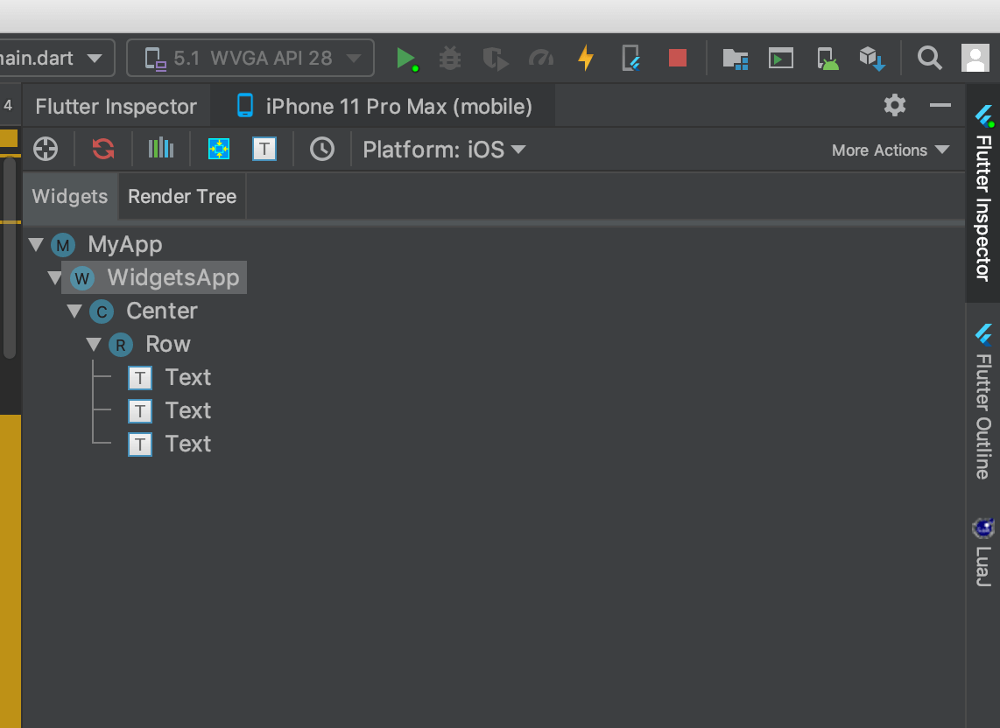

## WidgetsApp

一般情况下，不会直接使用WidgetsApp，而是使用`MaterialApp`或者`CupertinoApp`，WidgetsApp组件中有18个参数属性和`MaterialApp`一样，这些参数可以参考`MaterialApp`中的说明，下面说说有差别的参数。

### textStyle

应用程序默认字体，用法如下：

```dart
WidgetsApp(
  textStyle: TextStyle(fontSize: 19),
)
```

## debugShowWidgetInspector

`debugShowWidgetInspector`是在debug模式下打开widgets检查器，此时在模拟器（或者手机）上点击某个控件，代码会直接跳转到相关控件，用法如下：

```dart
WidgetsApp(
  debugShowWidgetInspector: true,
  ...
)
```

这个参数分成方便调试，在Android Studio上也有Flutter Inspector，但目前只能显示控件树，不能图形化，不过据说图形化功能已经快开发完成了，Flutter Inspector效果如下图：



## inspectorSelectButtonBuilder

打开`debugShowWidgetInspector`的情况下，点击一个控件时构建一个按钮，用法如下：

```dart
WidgetsApp(
  debugShowWidgetInspector: true,
  inspectorSelectButtonBuilder: (BuildContext context, VoidCallback onPressed) {
    return FloatingActionButton(
      child: const Icon(Icons.search),
      onPressed: onPressed,
      mini: true,
    );
  },
  ...
)
```

