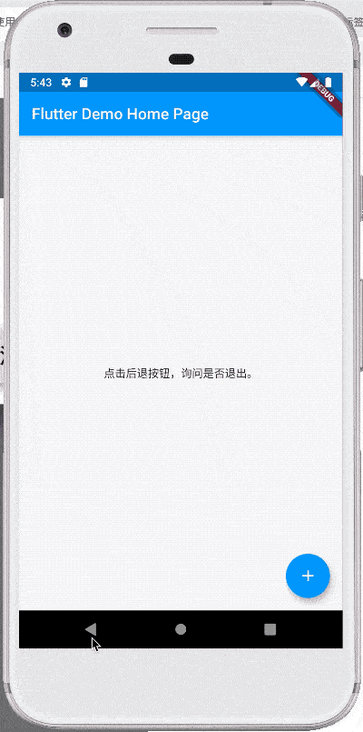
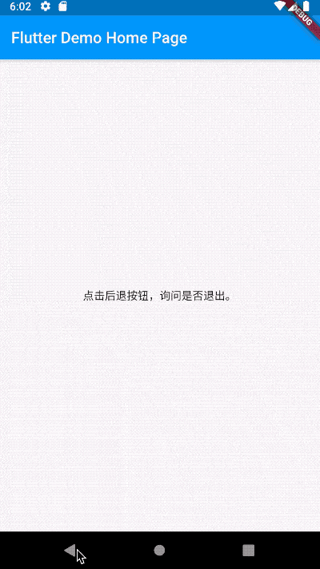
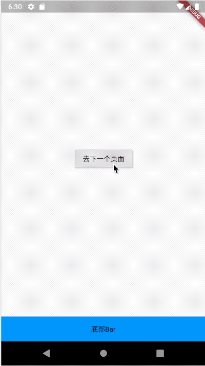

# WillPopScope

WillPopScope用于处理是否离开当前页面，在Flutter中有多种方式可以离开当前页面，比如AppBar、CupertinoNavigationBar上面的返回按钮，点击将会回到前一个页面，在Android手机上点击实体（虚拟）返回按钮，也将会回到前一个页面，此功能对于iOS程序员来说可能特别容易忽略。

以下几种情况我们会用到WillPopScope：

1. 需要询问用户是否退出。
2. App中有多个Navigator，想要的是让其中一个 Navigator 退出，而不是直接让在 Widget tree 底层的 Navigator 退出。


## 询问用户是否退出

在Android App中最开始的页面点击后退按钮，默认会关闭当前activity并回到桌面，我们希望此时弹出对话框或者给出提示“再次点击退出”，避免用户的误操作。

```dart
WillPopScope(
    onWillPop: () async => showDialog(
        context: context,
        builder: (context) =>
            AlertDialog(title: Text('你确定要退出吗？'), actions: <Widget>[
              RaisedButton(
                  child: Text('退出'),
                  onPressed: () => Navigator.of(context).pop(true)),
              RaisedButton(
                  child: Text('取消'),
                  onPressed: () => Navigator.of(context).pop(false)),
            ])),
    child: Container(
      alignment: Alignment.center,
      child: Text('点击后退按钮，询问是否退出。'),
    ))
```



我们也可以把效果做成快速点击2次退出：

```dart
DateTime _lastQuitTime;
WillPopScope(
    onWillPop: () async {
      if (_lastQuitTime == null ||
          DateTime.now().difference(_lastQuitTime).inSeconds > 1) {
        print('再按一次 Back 按钮退出');
        Scaffold.of(context)
            .showSnackBar(SnackBar(content: Text('再按一次 Back 按钮退出')));
        _lastQuitTime = DateTime.now();
        return false;
      } else {
        print('退出');
        Navigator.of(context).pop(true);
        return true;
      }
    },
    child: Container(
      alignment: Alignment.center,
      child: Text('点击后退按钮，询问是否退出。'),
    ))
```




## App中有多个Navigator

我们的App通常是在**MaterialApp**和**CupertinoApp**下，**MaterialApp**和**CupertinoApp**本身有一个Navigator，所以默认情况下调用**Navigator.pop**或者**Navigator.push**就是在操作此Navigator。不过在一些情况下，我们希望有自己定义的Navigator，比如如下场景：

- 在页面底部有一个常驻bar，其上展示内容，这个常驻bar就需要一个自己的Navigator。
- 在使用TabView、BottomNavigationBar、CupertinoTabView这些组件时，希望有多个Tab，但每个Tab中有自己的导航行为，这时需要给每一个Tab加一个Navigator。

首页：

```dart
class MyHomePage extends StatefulWidget {
  MyHomePage({Key key, this.title}) : super(key: key);

  final String title;

  @override
  _MyHomePageState createState() => _MyHomePageState();
}

class _MyHomePageState extends State<MyHomePage> {

  GlobalKey<NavigatorState> _key = GlobalKey();

  @override
  Widget build(BuildContext context) {
    return Scaffold(
      body: WillPopScope(
          onWillPop: () async {
            if (_key.currentState.canPop()) {
              _key.currentState.pop();
              return false;
            }
            return true;
          },
          child: Column(
            children: <Widget>[
              Expanded(
                child: Navigator(
                  key: _key,
                  onGenerateRoute: (RouteSettings settings) =>
                      MaterialPageRoute(builder: (context) {
                    return OnePage();
                  }),
                ),
              ),
              Container(
                height: 50,
                color: Colors.blue,
                alignment: Alignment.center,
                child: Text('底部Bar'),
              )
            ],
          )),
    );
  }
}
```

第一个页面：

```dart
class OnePage extends StatelessWidget {
  @override
  Widget build(BuildContext context) {
    return Scaffold(
      body: Center(
        child: Container(
          child: RaisedButton(
            child: Text('去下一个页面'),
            onPressed: () {
              Navigator.push(context, MaterialPageRoute(builder: (context) {
                return TwoPage();
              }));
            },
          ),
        ),
      ),
    );
  }
}
```

第二个页面：

```dart
class TwoPage extends StatelessWidget {
  @override
  Widget build(BuildContext context) {
    return Scaffold(
      body: Center(
        child: Container(
          child: Text('这是第二个页面'),
        ),
      ),
    );
  }
}
```





使用TabView、BottomNavigationBar、CupertinoTabView这些组件时也是一样的原理，只需在每一个Tab中加入Navigator，不要忘记指定**key**。

