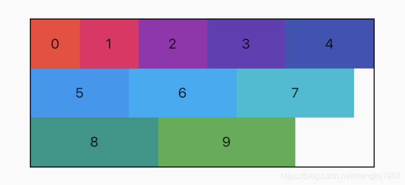
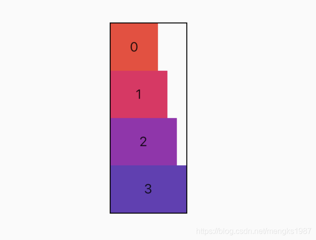
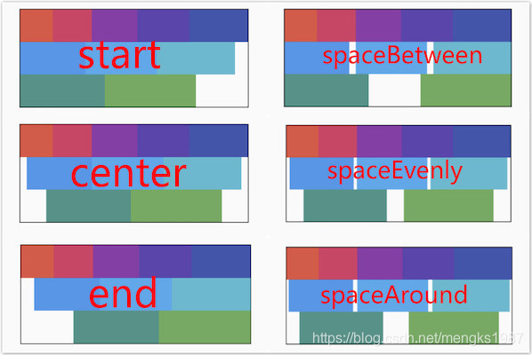
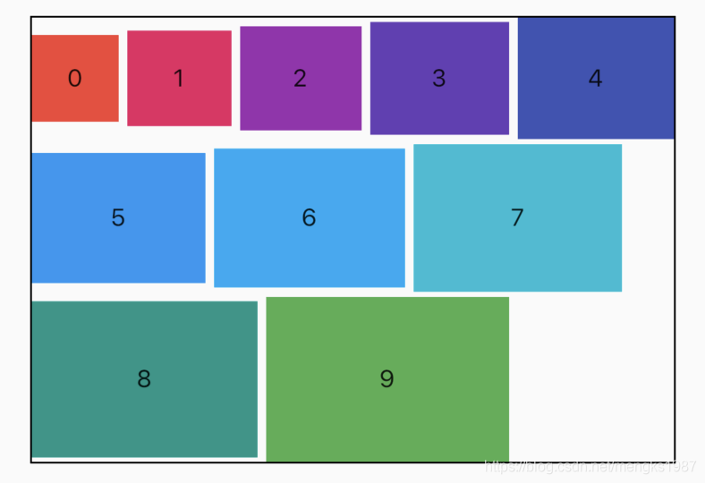
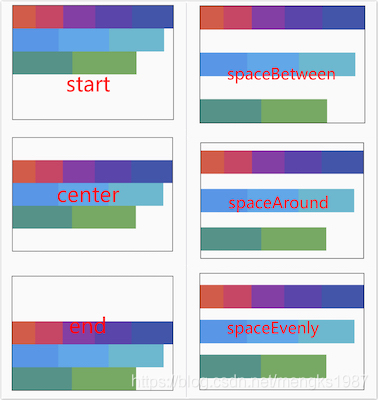
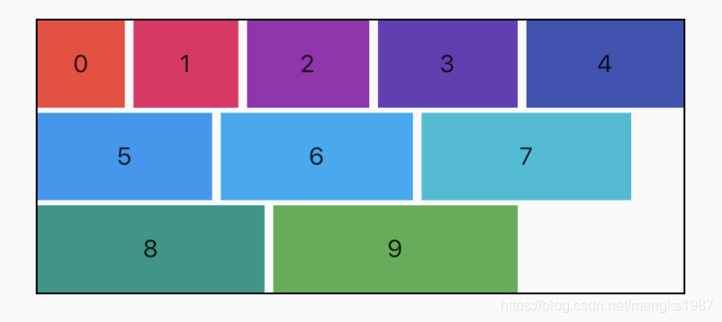
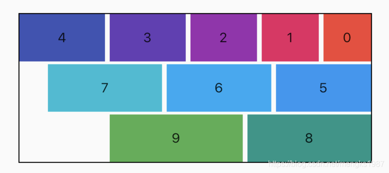

# Wrap

Wrap可以为子控件进行水平或者垂直方向布局，且当空间用完时，Wrap会自动换行，也是常说的流式​布局。

创建多个子控件做为Wrap的子控件，代码如下：
```
Wrap(
      children: List.generate(10, (i) {
        double w = 50.0 + 10 * i;
        return Container(
          color: Colors.primaries[i],
          height: 50,
          width: w,
		  child: Text('$i'),
        );
      }),
    )
```
效果如图：


### 布局方向
`direction`属性控制布局方向，默认为水平方向，设置方向为垂直代码如下：
```
Wrap(
	direction: Axis.vertical,
	...
)
```
效果如图：



### 对齐方式

`alignment`属性控制主轴对齐方式，`crossAxisAlignment`属性控制交叉轴对齐方式，对齐方式只对有剩余空间的行或者列起作用，例如水平方向上正好填充完整，则不管设置主轴对齐方式为什么，看上去的效果都是铺满。

> 说明：主轴就是与当前控件方向一致的轴，而交叉轴就是与当前控件方向垂直的轴，如果Wrap的布局方向为水平方向`Axis.horizontal`,那么主轴就是水平方向，反之布局方向为垂直方向` Axis.vertical`，主轴就是垂直方向。

设置主轴对齐方式代码如下：
```
Wrap(
	alignment: WrapAlignment.spaceBetween,
	...
)
```
主轴对齐方式有6种，效果如下图：



>spaceAround和spaceEvenly区别是：
> - spaceAround：第一个子控件距开始位置和最后一个子控件距结尾位置是其他子控件间距的一半。
> - spaceEvenly：所有间距一样。


设置交叉轴对齐代码如下：

```
Wrap(
	crossAxisAlignment: WrapCrossAlignment.center,
	...
)
```
如果Wrap的主轴方向为水平方向，交叉轴方向则为垂直方向，如果想要看到交叉轴对齐方式的效果需要设置子控件的高不一样，代码如下：
```
Wrap(
      spacing: 5,
      runSpacing: 3,
      crossAxisAlignment: WrapCrossAlignment.center,
      children: List.generate(10, (i) {
        double w = 50.0 + 10 * i;
        double h = 50.0 + 5 * i;
        return Container(
          color: Colors.primaries[i],
          height: h,
          alignment: Alignment.center,
          width: w,
          child: Text('$i'),
        );
      }),
    )
```
效果如下图：



`runAlignment`属性控制Wrap的主轴垂直方向每一行的对齐方式，语言描述大家可能云里雾绕的，下面直接看`runAlignment`6中方式对应的效果图，



`runAlignment`和`alignment`的区别：

`alignment`是主轴方向上对齐方式，作用于每一行。
`runAlignment`是垂直主轴方向上将每一行看作一个整体的对齐方式。

设置`runAlignment`属性代码如下：
```
Wrap(
	runAlignment: WrapAlignment.spaceEvenly,
	...
)
```
<font color='red'>`runAlignment`、`alignment`、`crossAxisAlignment`这3个属性如果只是从文字上描述是比较难描述清楚的，上面提供了效果图，方便大家理解，这3个属性是Wrap最重要的属性。</font>

### 间隔

`spacing`和`runSpacing` 属性控制Wrap主轴方向和交叉轴方向子控件之间的间隙，代码如下：
```
Wrap(
	spacing: 5,
    runSpacing: 2,
	...
)
```
效果如下：



### textDirection

`textDirection`属性表示Wrap主轴方向上子控件的方向，取值范围是`ltr`（从左到右）和`rtl`（从右到左），下面是从右到左的代码：
```
Wrap(
	textDirection: TextDirection.rtl,
	...
)
```
效果如下：



### verticalDirection
`verticalDirection`属性表示Wrap交叉轴方向上子控件的方向，取值范围是`up`（从上到下）和`down`（从下到上），设置代码如下：
```
Wrap(
	verticalDirection: VerticalDirection.up,
	...
)
```
效果如下：


