## showDialog

showDialog 用于弹出Material风格对话框，基本用法如下：

```dart
showDialog(
    context: context,
    builder: (context) {
      return AlertDialog(
        ...
      );
    }
);
```

效果如下：

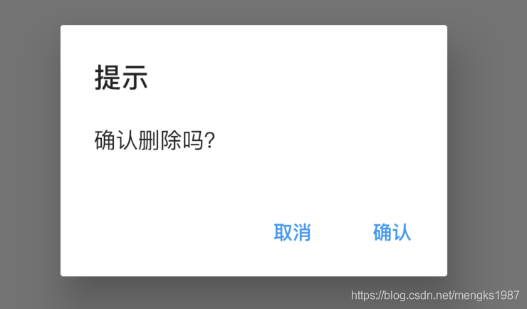

`builder`通常返回`Dialog`组件，比如`SimpleDialog`和`AlertDialog`。

`useRootNavigator`参数用于确定是否将对话框推送到给定“context”最远或最接近的`Navigator`。默认情况下，`useRootNavigator`为“true”，被推送到根`Navigator`。如果应用程序有多个`Navigator`，关闭对话框需要使用

```dart
Navigator.of(context, rootNavigator: true).pop(result)
```

而不是

```dart
Navigator.pop(context, result)
```


`barrierDismissible`参数确认点击提示框外部区域时是否弹出提示框，默认true。


## showCupertinoDialog

showCupertinoDialog 用于弹出ios风格对话框，基本用法如下：

```dart
showCupertinoDialog(
    context: context,
    builder: (context) {
      return CupertinoAlertDialog(
       ...
      );
    });
```

效果如下：

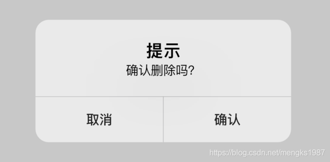

`builder`通常返回`CupertinoDialog`或者`CupertinoAlertDialog`。

## showGeneralDialog

如果上面2种提示框不满足你的需求，还可以使用showGeneralDialog自定义提示框，事实上，showDialog和showCupertinoDialog也是通过showGeneralDialog实现的，基本用法如下：

```dart
showGeneralDialog(
    context: context,
    barrierDismissible:true,
    barrierLabel: '',
    transitionDuration: Duration(milliseconds: 200),
    pageBuilder: (BuildContext context, Animation<double> animation,
        Animation<double> secondaryAnimation) {
      return Center(
        child: Container(
          height: 300,
          width: 250,
          color: Colors.lightGreenAccent,
        ),
      );
    });
```

效果如下：

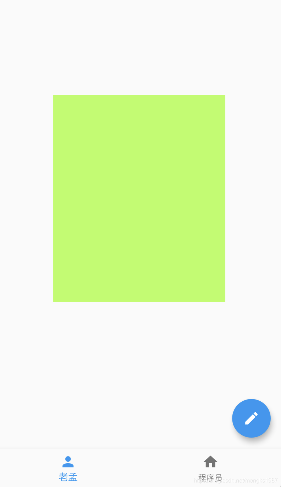

加上背景颜色：

```dart
showGeneralDialog(
    context: context,
    barrierColor: Colors.black.withOpacity(.5),
    ...
  )
```

效果如下：

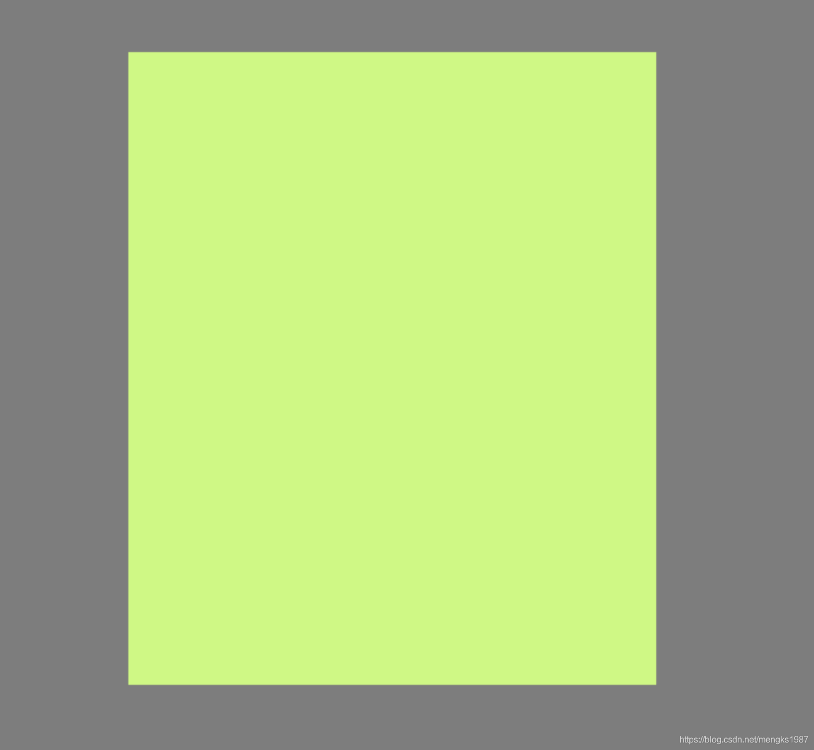


`barrierDismissible`:是否可以点击背景关闭。

`barrierColor`：背景颜色

`transitionDuration`：动画时长，

`transitionBuilder`是构建进出动画，默认动画是渐隐渐显，构建缩放动画代码如下：

```dart
showGeneralDialog(
    transitionBuilder: (BuildContext context, Animation<double> animation,
        Animation<double> secondaryAnimation, Widget child) {
      return ScaleTransition(scale: animation, child: child);
    },
    ...
  )
```

效果如下：

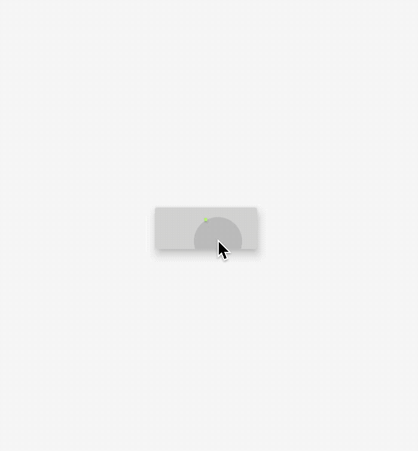


## showAboutDialog

AboutDialog用于描述当前App信息，底部提供2个按钮：查看许可按钮和关闭按钮。AboutDialog需要和showAboutDialog配合使用，用法如下：

```dart
showAboutDialog(
  context: context,
  applicationIcon: Image.asset(
    'images/bird.png',
    height: 100,
    width: 100,
  ),
  applicationName: '应用程序',
  applicationVersion: '1.0.0',
  applicationLegalese: 'copyright 老孟，一枚有态度的程序员',
  children: <Widget>[
    Container(
      height: 30,
      color: Colors.red,
    ),
    Container(
      height: 30,
      color: Colors.blue,
    ),
    Container(
      height: 30,
      color: Colors.green,
    )
  ],
);
```

效果如下：


属性说明如下：

- `applicationIcon`：应用程序的图标。
- `applicationName`：应用程序名称。
- `applicationVersion`：应用程序版本。
- `applicationLegalese`：著作权（copyright）的提示。
- `children`：位置如上图的红蓝绿色的位置。

所有的属性都需要手动设置，不是自动获取的。

下面的2个按钮根据应用程序支持的语言显示相应的语言，比如显示中文方法如下：

1. 在`pubspec.yaml`中配置支持国际化：

```dart
dependencies:
  flutter:
    sdk: flutter
  flutter_localizations:
    sdk: flutter
```

2. 在MaterialApp中配置当前区域：

```dart
MaterialApp(
      title: 'Flutter Demo',
      localizationsDelegates: [
        GlobalMaterialLocalizations.delegate,
        GlobalWidgetsLocalizations.delegate,
      ],
      supportedLocales: [
        const Locale('zh', 'CH'),
        const Locale('en', 'US'),
      ],
      locale: Locale('zh'),
      ...
  )
```

此时效果：


此时点击查看许将会调用`showLicensePage`,相关效果可以查看`showLicensePage`。


## showLicensePage

此控件基本不会用到，浏览一下即可。

LicensePage用于描述当前App许可信息，LicensePage需要和showLicensePage配合使用，用法如下：

```dart
showLicensePage(
  context: context,
  applicationIcon: Image.asset(
    'images/bird.png',
    height: 100,
    width: 100,
  ),
  applicationName: '应用程序',
  applicationVersion: '1.0.0',
  applicationLegalese: 'copyright 老孟，一枚有态度的程序员',
);
```

效果如下：

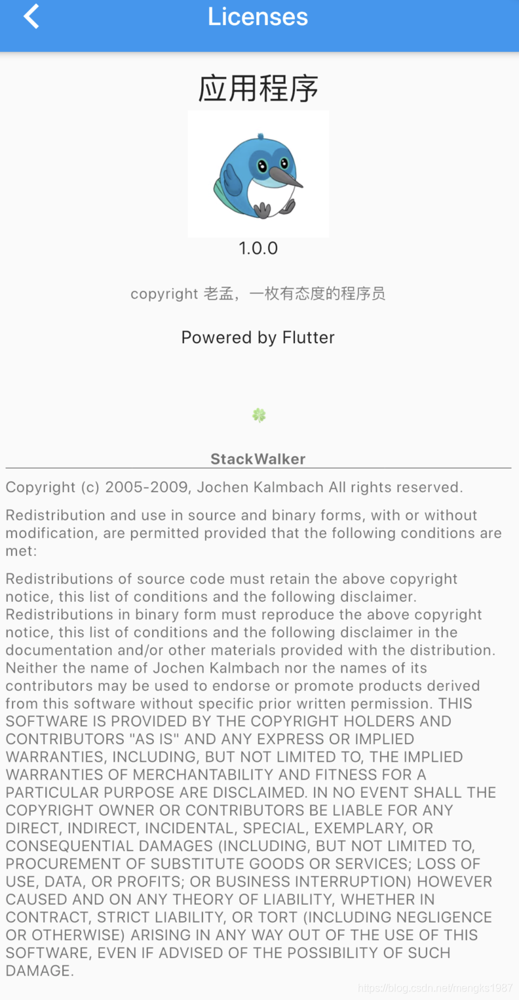

下面的英文我们是无法更改的。

## showBottomSheet

在最近的`Scaffold`父组件上展示一个material风格的bottom sheet，位置同`Scaffold`组件的`bottomSheet`，如果`Scaffold`设置了`bottomSheet`，调用showBottomSheet抛出异常。

基本用法如下：

```dart
showBottomSheet(
    context: context,
    builder: (context) {
      return Container(height: 200, color: Colors.lightBlue);
    });
```

效果如下：

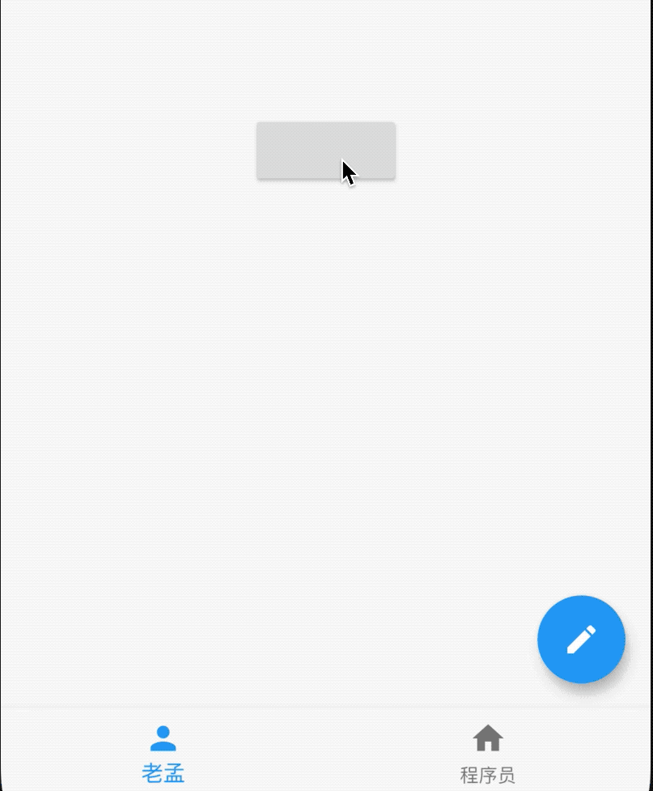

设置其背景颜色、阴影值、形状：

```dart
showBottomSheet(
    context: context,
    backgroundColor: Colors.lightGreenAccent,
    elevation:20,
    shape: CircleBorder(),
    builder: (context) {
      return Container(height: 200);
    });
```

效果如下：

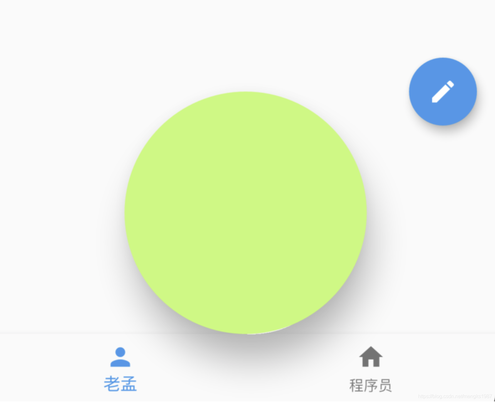


通常情况下，我们希望直接从底部弹出，`showModalBottomSheet`提供了直接从底部弹出的功能。

## showModalBottomSheet

从底部弹出，通常和BottomSheet配合使用，用法如下：

```dart
showModalBottomSheet(
        context: context,
        builder: (BuildContext context) {
          return BottomSheet(...);
        });
```

效果如下：

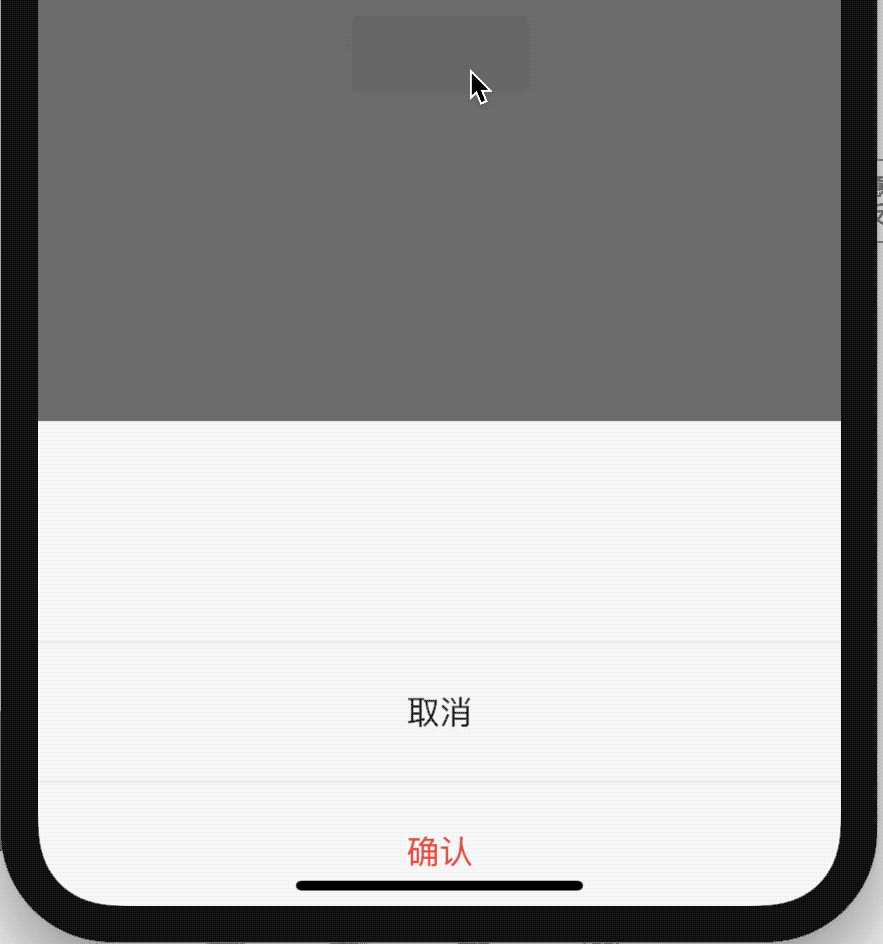

设置背景、阴影、形状：

```dart
showModalBottomSheet(
    context: context,
    backgroundColor: Colors.lightBlue,
    elevation: 10,
    shape: RoundedRectangleBorder(borderRadius: BorderRadius.circular(30)),
    ...
  )
```

效果如下：

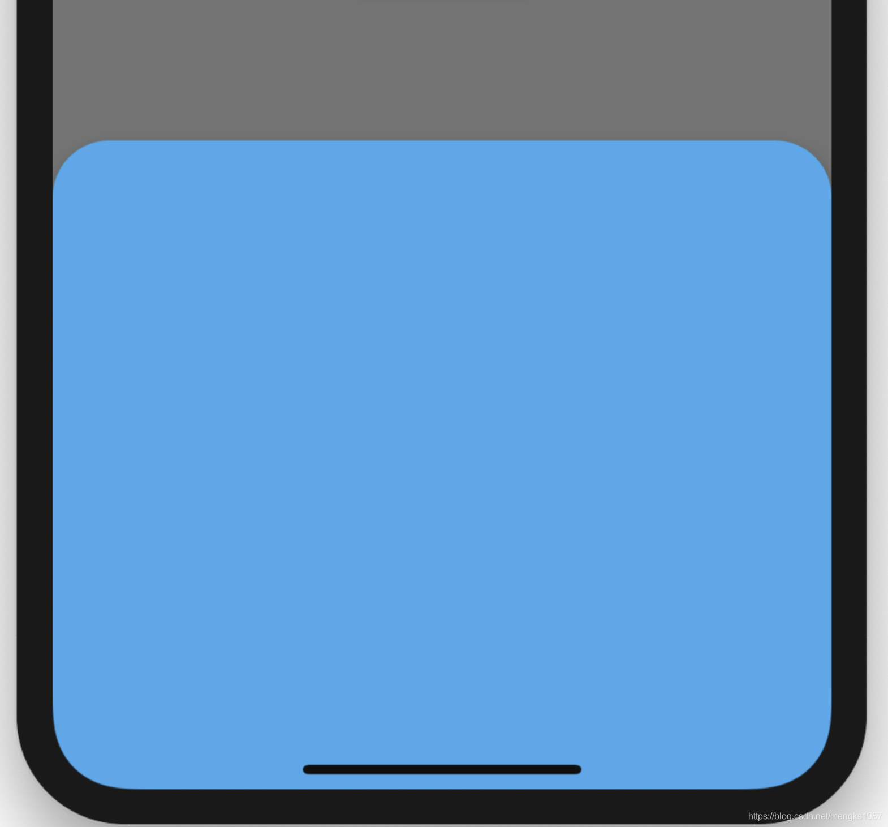

`isDismissible`:是否可以点击背景关闭。

 `isScrollControlled`参数指定是否使用可拖动的可滚动的组件，如果子组件是ListView或者GridView，此参数应该设置为true，设置为true后，最大高度可以占满全屏。用法如下：

```dart
showModalBottomSheet(
    context: context,
    isScrollControlled: true,
    builder: (BuildContext context) {
      return ListView.builder(
        itemBuilder: (context, index) {
          return ListTile(
            title: Text('老孟$index'),
          );
        },
        itemExtent: 50,
        itemCount: 50,
      );
    });
```

## showCupertinoModalPopup

showCupertinoModalPopup 展示ios的风格弹出框，通常情况下和CupertinoActionSheet配合使用，用法如下：

```dart
showCupertinoModalPopup(
    context: context,
    builder: (BuildContext context) {
      return CupertinoActionSheet(
        title: Text('提示'),
        message: Text('是否要删除当前项？'),
        actions: <Widget>[
          CupertinoActionSheetAction(
            child: Text('删除'),
            onPressed: () {},
            isDefaultAction: true,
          ),
          CupertinoActionSheetAction(
            child: Text('暂时不删'),
            onPressed: () {},
            isDestructiveAction: true,
          ),
        ],
      );
    }
);
```

效果如下：

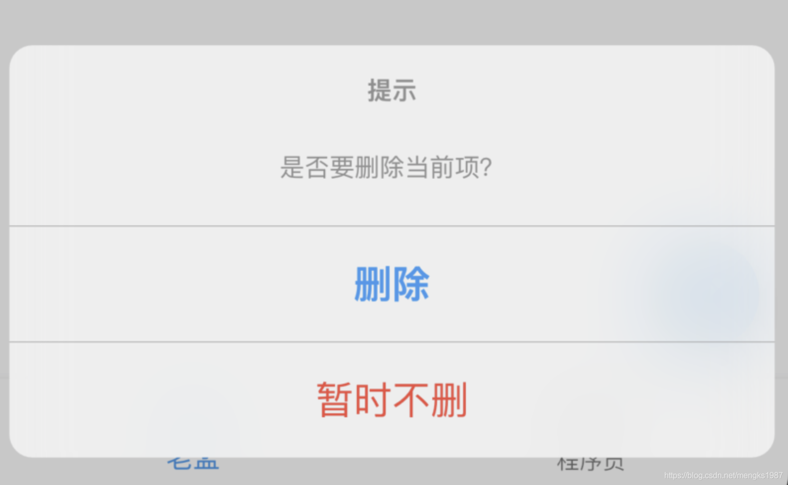


`filter`参数可以对弹出框以外的区域做模糊或者矩阵操作，用法如下：

```dart
showCupertinoModalPopup(
    context: context,
    filter: ImageFilter.blur(sigmaX: 5.0, sigmaY: 5.0),
    ...
  )
```

效果如下：

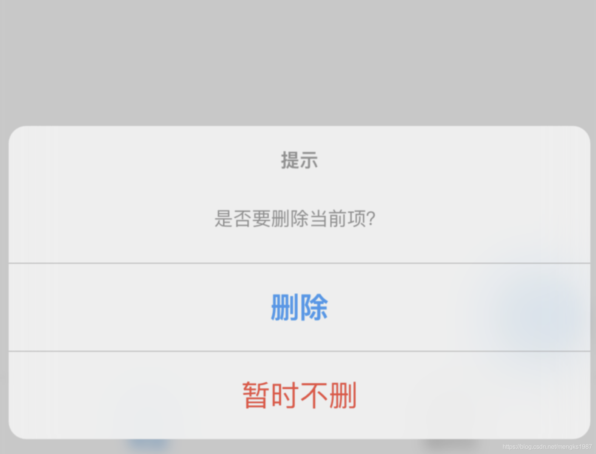

弹出框以外的区域有毛玻璃的效果。

## showMenu

showMenu弹出一个Menu菜单，用法如下：

```dart
showMenu(
    context: context,
    position: RelativeRect.fill,
    items: <PopupMenuEntry>[
      PopupMenuItem(child: Text('语文')),
      PopupMenuDivider(),
      CheckedPopupMenuItem(
        child: Text('数学'),
        checked: true,
      ),
      PopupMenuDivider(),
      PopupMenuItem(child: Text('英语')),
    ]);
```

`position`参数表示弹出的位置，效果如下：

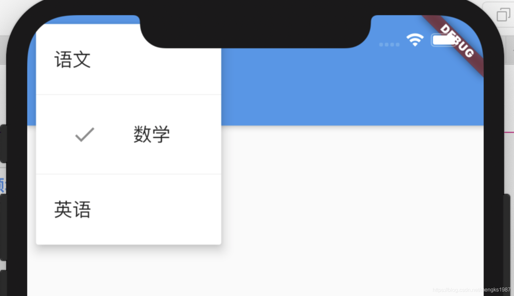

弹出的位置在屏幕的左上角，我们希望弹出的位置在点击按钮的位置，因此需要计算按钮的位置，计算如下：

```dart
final RenderBox button = context.findRenderObject();
final RenderBox overlay = Overlay.of(context).context.findRenderObject();
final RelativeRect position = RelativeRect.fromRect(
  Rect.fromPoints(
    button.localToGlobal(Offset(0, 0), ancestor: overlay),
    button.localToGlobal(button.size.bottomRight(Offset.zero),
        ancestor: overlay),
  ),
  Offset.zero & overlay.size,
);
```

你需要将按钮单独封装为StatefulWidget组件，否则context代表的就不是按钮组件。


## showSearch

showSearch 是直接跳转到搜索页面，用法如下：

```dart
showSearch(context: context, delegate: CustomSearchDelegate());

class CustomSearchDelegate extends SearchDelegate<String>{
  @override
  List<Widget> buildActions(BuildContext context) {
    return null;
  }

  @override
  Widget buildLeading(BuildContext context) {
    return null;
  }

  @override
  Widget buildResults(BuildContext context) {
    return null;
  }

  @override
  Widget buildSuggestions(BuildContext context) {
    return null;
  }

}
```

使用showSearch，首先需要重写一个SearchDelegate，实现其中的4个方法。

`buildLeading`表示构建搜索框前面的控件，一般是一个返回按钮，点击退出，代码如下：

```dart
@override
Widget buildLeading(BuildContext context) {
  return IconButton(
    icon: Icon(Icons.arrow_back,color: Colors.blue,),
    onPressed: (){
      close(context, '');
    },
  );
}
```

效果如下：

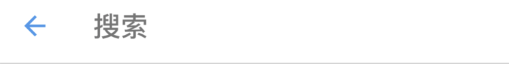

`buildSuggestions`是用户正在输入时显示的控件，输入框放生变化时回调此方法，通常返回一个ListView，点击其中一项时，将当前项的内容填充到输入框，用法如下：

```dart
@override
Widget buildSuggestions(BuildContext context) {
  return ListView.separated(
    itemBuilder: (context, index) {
      return ListTile(
        title: Text('老孟 $index'),
        onTap: () {
          query = '老孟 $index';
        },
      );
    },
    separatorBuilder: (context, index) {
      return Divider();
    },
    itemCount: Random().nextInt(5),
  );
}
```

效果如下：

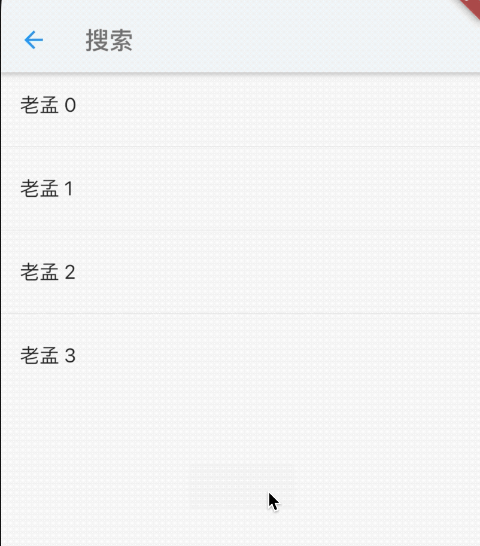

`buildActions`输入框后面的控件，一般情况下，输入框不为空，显示一个清空按钮，点击清空输入框：

```dart
@override
List<Widget> buildActions(BuildContext context) {
  return [
    IconButton(
      icon: Icon(
        Icons.clear,
      ),
      onPressed: () {
        query = '';
      },
    )
  ];
}
```

`buildResults`是构建搜索结果控件，当用户点击软键盘上的“Search”时回调此方法，一般返回ListView，用法如下：

```dart
@override
Widget buildResults(BuildContext context) {
  return ListView.separated(
    itemBuilder: (context, index) {
      return Container(
        height: 60,
        alignment: Alignment.center,
        child: Text(
          '$index',
          style: TextStyle(fontSize: 20),
        ),
      );
    },
    separatorBuilder: (context, index) {
      return Divider();
    },
    itemCount: 10,
  );
}
```

效果如下：

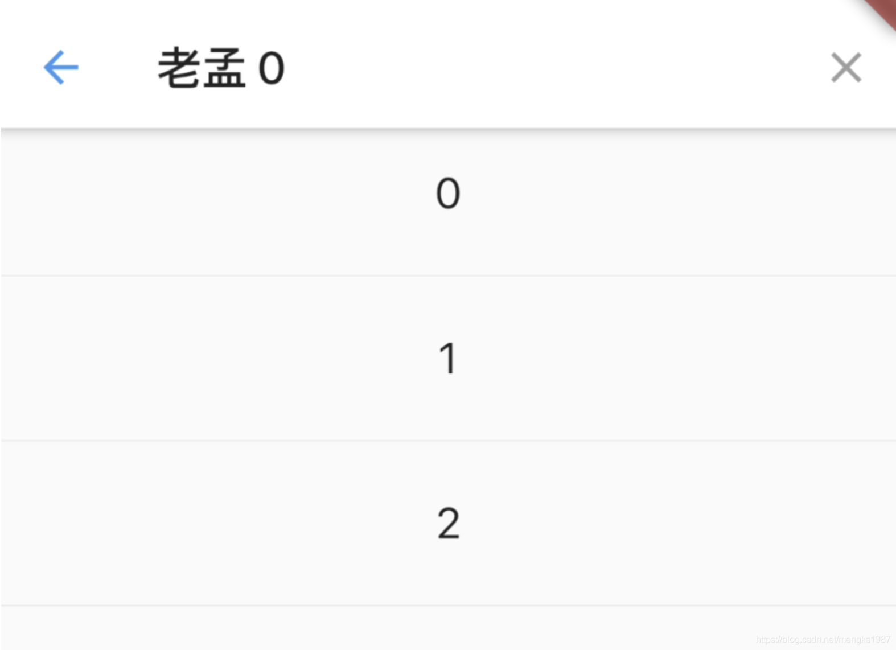

