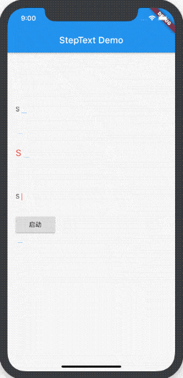
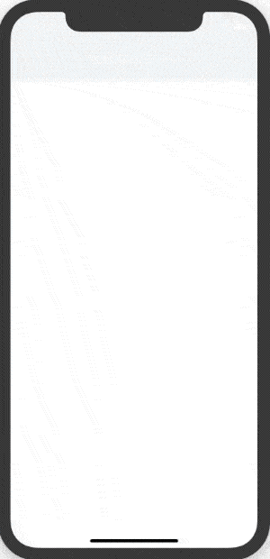
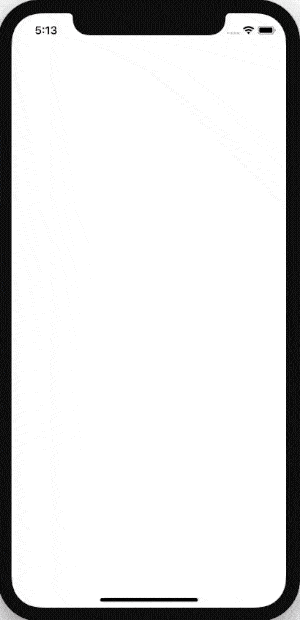
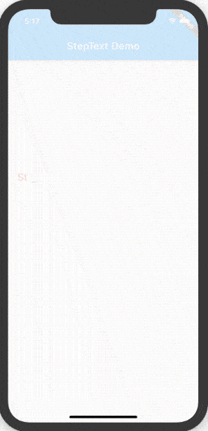
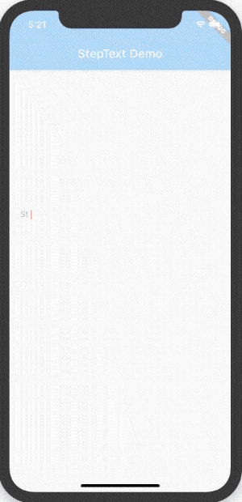
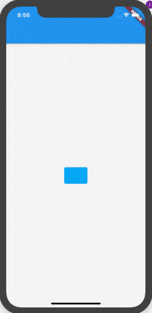

**WriteText** 组件是一个文本步进组件，即字符一个一个显示，就像手写一样。





> pub 地址：[https://pub.dev/packages/write_text](https://pub.dev/packages/write_text)
>
> Github 地址：[https://github.com/781238222/flutter-do/tree/master/write_text](https://github.com/781238222/flutter-do/tree/master/write_text)


### 引入软件包

在 `pubspec.yaml` 中添加如下依赖：

```dart
dependencies:
  write_text: ^0.0.1
```

执行命令：

```
flutter pub get
```


### 使用

```dart
WriteText(data: 'StepText 是一个步进文本组件，即字符一个一个显示，就像手写一样。'),
```



默认情况下，每个字符出现时长是 **300 ms**，设置时长为 1 秒：

```dart
WriteText(
  data: 'StepText 是一个步进文本组件，即字符一个一个显示，就像手写一样。',
  perMillSeconds: 1000,
)
```



设置字体样式

```dart
WriteText(
  data: 'StepText 是一个步进文本组件，即字符一个一个显示，就像手写一样。',
  textStyle: TextStyle(fontSize: 20, color: Colors.red),
)
```




设置不显示光标：

```dart
WriteText(
  data: 'StepText 是一个步进文本组件，即字符一个一个显示，就像手写一样。',
  showCursor: false,
),
```


设置自定义光标：

```dart
WriteText(
  data: 'StepText 是一个步进文本组件，即字符一个一个显示，就像手写一样。',
  cursor: Container(
    width: 2,
    height: 16,
    color: Colors.red,
  ),
)
```




主动控制组件的启动和暂停：

```dart
WriteTextController _controller = WriteTextController();
bool starting = false;

RaisedButton(
              onPressed: () {
                if (starting) {
                  starting = false;
                  _controller.stop();
                } else {
                  starting = true;
                  _controller.start();
                }
                setState(() {});
              },
              child: Text('${starting ? '暂停' : '启动'}'),
            ),
            WriteText(
              data: _data,
              controller: _controller,
              autoStart: false,
            ),
```


看下面的效果




完整代码如下：

```dart
class Demo extends StatefulWidget {
  @override
  _DemoState createState() => _DemoState();
}

class _DemoState extends State<Demo> with SingleTickerProviderStateMixin {
  AnimationController _controller;

  @override
  void initState() {
    _controller =
        AnimationController(vsync: this, duration: Duration(seconds: 2));
    _controller.forward();
    super.initState();
  }

  @override
  void dispose() {
    _controller.dispose();
    super.dispose();
  }

  @override
  Widget build(BuildContext context) {
    return Scaffold(
      appBar: AppBar(),
      body: Center(
        child: AnimatedBuilder(
          animation: _controller,
          builder: (BuildContext context, Widget child) {
            return Container(
              padding: EdgeInsets.symmetric(horizontal: 10),
              decoration: BoxDecoration(
                  color: Colors.lightBlue,
                  borderRadius: BorderRadius.circular(4)),
              height: 45,
              width: _controller.value * 200,
              alignment: Alignment.center,
              child: _controller.value == 1.0
                  ? WriteText(
                      data: '老孟 Flutter',
                      perMillSeconds: 200,
                      textStyle: TextStyle(fontSize: 16, color: Colors.white),
                      cursor: Container(
                        height: 2,
                        width: 8,
                        color: Colors.white,
                      ),
                    )
                  : Container(),
            );
          },
        ),
      ),
    );
  }
}
```

